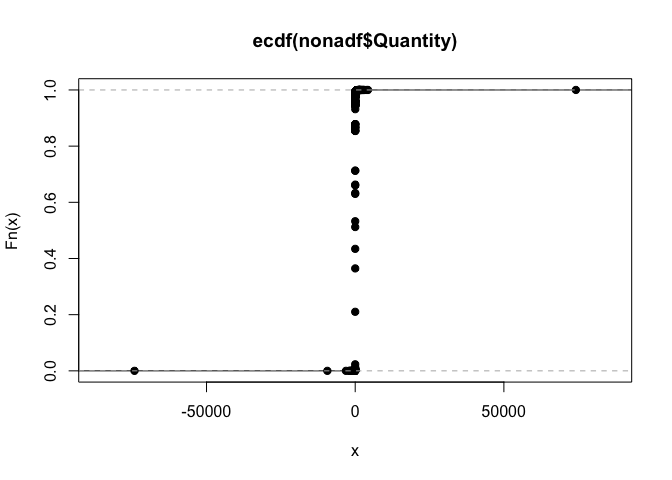
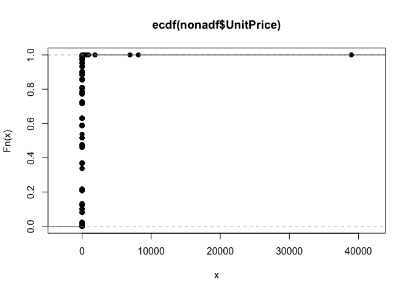

```r
knitr::opts_chunk$set(echo = TRUE)
library(readr)
library(dplyr)
```

```
## 
## Attaching package: 'dplyr'
```

```
## The following objects are masked from 'package:stats':
## 
##     filter, lag
```

```
## The following objects are masked from 'package:base':
## 
##     intersect, setdiff, setequal, union
```

```r
library(lubridate)
```

```
## 
## Attaching package: 'lubridate'
```

```
## The following object is masked from 'package:base':
## 
##     date
```

```r
library(stringr)
```

Load data.


```r
df <- read_csv("../data/raw/online_retail.csv")
```

```
## Parsed with column specification:
## cols(
##   InvoiceNo = col_character(),
##   StockCode = col_character(),
##   Description = col_character(),
##   Quantity = col_integer(),
##   InvoiceDate = col_character(),
##   UnitPrice = col_double(),
##   CustomerID = col_integer(),
##   Country = col_character()
## )
```

```r
head(df)
```

```
## # A tibble: 6 x 8
##   InvoiceNo StockCode Description           Quantity InvoiceDate UnitPrice
##   <chr>     <chr>     <chr>                    <int> <chr>           <dbl>
## 1 536365    85123A    WHITE HANGING HEART …        6 12/1/10 8:…      2.55
## 2 536365    71053     WHITE METAL LANTERN          6 12/1/10 8:…      3.39
## 3 536365    84406B    CREAM CUPID HEARTS C…        8 12/1/10 8:…      2.75
## 4 536365    84029G    KNITTED UNION FLAG H…        6 12/1/10 8:…      3.39
## 5 536365    84029E    RED WOOLLY HOTTIE WH…        6 12/1/10 8:…      3.39
## 6 536365    22752     SET 7 BABUSHKA NESTI…        2 12/1/10 8:…      7.65
## # ... with 2 more variables: CustomerID <int>, Country <chr>
```

# Data Structure and Validation

Look at the structure of data to see if we need to transform any variables for later analysis, or if we have missing values and any outliers.


```r
str(df)
```

```
## Classes 'tbl_df', 'tbl' and 'data.frame':	240007 obs. of  8 variables:
##  $ InvoiceNo  : chr  "536365" "536365" "536365" "536365" ...
##  $ StockCode  : chr  "85123A" "71053" "84406B" "84029G" ...
##  $ Description: chr  "WHITE HANGING HEART T-LIGHT HOLDER" "WHITE METAL LANTERN" "CREAM CUPID HEARTS COAT HANGER" "KNITTED UNION FLAG HOT WATER BOTTLE" ...
##  $ Quantity   : int  6 6 8 6 6 2 6 6 6 32 ...
##  $ InvoiceDate: chr  "12/1/10 8:26" "12/1/10 8:26" "12/1/10 8:26" "12/1/10 8:26" ...
##  $ UnitPrice  : num  2.55 3.39 2.75 3.39 3.39 7.65 4.25 1.85 1.85 1.69 ...
##  $ CustomerID : int  17850 17850 17850 17850 17850 17850 17850 17850 17850 13047 ...
##  $ Country    : chr  "United Kingdom" "United Kingdom" "United Kingdom" "United Kingdom" ...
##  - attr(*, "spec")=List of 2
##   ..$ cols   :List of 8
##   .. ..$ InvoiceNo  : list()
##   .. .. ..- attr(*, "class")= chr  "collector_character" "collector"
##   .. ..$ StockCode  : list()
##   .. .. ..- attr(*, "class")= chr  "collector_character" "collector"
##   .. ..$ Description: list()
##   .. .. ..- attr(*, "class")= chr  "collector_character" "collector"
##   .. ..$ Quantity   : list()
##   .. .. ..- attr(*, "class")= chr  "collector_integer" "collector"
##   .. ..$ InvoiceDate: list()
##   .. .. ..- attr(*, "class")= chr  "collector_character" "collector"
##   .. ..$ UnitPrice  : list()
##   .. .. ..- attr(*, "class")= chr  "collector_double" "collector"
##   .. ..$ CustomerID : list()
##   .. .. ..- attr(*, "class")= chr  "collector_integer" "collector"
##   .. ..$ Country    : list()
##   .. .. ..- attr(*, "class")= chr  "collector_character" "collector"
##   ..$ default: list()
##   .. ..- attr(*, "class")= chr  "collector_guess" "collector"
##   ..- attr(*, "class")= chr "col_spec"
```

```r
summary(df)
```

```
##   InvoiceNo          StockCode         Description       
##  Length:240007      Length:240007      Length:240007     
##  Class :character   Class :character   Class :character  
##  Mode  :character   Mode  :character   Mode  :character  
##                                                          
##                                                          
##                                                          
##                                                          
##     Quantity         InvoiceDate          UnitPrice          CustomerID   
##  Min.   :-74215.00   Length:240007      Min.   :    0.00   Min.   :12346  
##  1st Qu.:     1.00   Class :character   1st Qu.:    1.25   1st Qu.:13842  
##  Median :     3.00   Mode  :character   Median :    2.10   Median :15132  
##  Mean   :     9.28                      Mean   :    5.12   Mean   :15275  
##  3rd Qu.:    10.00                      3rd Qu.:    4.21   3rd Qu.:16814  
##  Max.   : 74215.00                      Max.   :38970.00   Max.   :18287  
##                                                            NA's   :67225  
##    Country         
##  Length:240007     
##  Class :character  
##  Mode  :character  
##                    
##                    
##                    
## 
```

From data summary, 

1. I confirm that `UnitPrice` is larger than 0. `Quantity` has negative numbers which indicate returns.

2. I'm curious how many countries are there in the data, and how many transactions each country had.

There are 38 countries present in this dataset, but 92% of observations belong to United Kingdom. Customer segmentation in different countries can be different. Thus, for this project, I'll focus on United Kingdom only. 


```r
df %>% 
  group_by(Country) %>% 
  summarise(n = n()) %>% 
  arrange(desc(n))
```

```
## Warning: package 'bindrcpp' was built under R version 3.4.4
```

```
## # A tibble: 38 x 2
##    Country             n
##    <chr>           <int>
##  1 United Kingdom 220279
##  2 Germany          4208
##  3 France           3642
##  4 EIRE             3034
##  5 Netherlands      1142
##  6 Spain            1142
##  7 Belgium           933
##  8 Switzerland       708
##  9 Australia         642
## 10 Portugal          624
## # ... with 28 more rows
```

Let's filter data to get only observations from United Kingdom.


```r
ukdf <- df %>% 
  filter(Country == "United Kingdom")
```

3. There are 66659 missing values in `CustomerID`. Since the purpose of this project is to segment customers using RFM methods, we need `CustomerID` to identify each customer. We can't identify through `InvoiceNo` since each customer can purchase more than 1 time. Thus, I'll remove all of these missing values. 


```r
summary(ukdf)
```

```
##   InvoiceNo          StockCode         Description       
##  Length:220279      Length:220279      Length:220279     
##  Class :character   Class :character   Class :character  
##  Mode  :character   Mode  :character   Mode  :character  
##                                                          
##                                                          
##                                                          
##                                                          
##     Quantity         InvoiceDate          UnitPrice          CustomerID   
##  Min.   :-74215.00   Length:220279      Min.   :    0.00   Min.   :12346  
##  1st Qu.:     1.00   Class :character   1st Qu.:    1.25   1st Qu.:14227  
##  Median :     3.00   Mode  :character   Median :    2.10   Median :15498  
##  Mean   :     8.24                      Mean   :    5.04   Mean   :15540  
##  3rd Qu.:     9.00                      3rd Qu.:    4.21   3rd Qu.:16942  
##  Max.   : 74215.00                      Max.   :38970.00   Max.   :18287  
##                                                            NA's   :66659  
##    Country         
##  Length:220279     
##  Class :character  
##  Mode  :character  
##                    
##                    
##                    
## 
```


```r
nonadf <- ukdf %>% 
  filter(!is.na(CustomerID))
```

2. Transform `InvoiceDate` from character to date form, removing hour and minute information. Note that transactions were recorded from December 1st, 2010.


```r
nonadf$InvoiceDate <- as_date(mdy_hm(nonadf$InvoiceDate))
```

3. There are outliers in `Quantity` and `UnitPrice`. Check distribution.

Ploting ECDF graphs for both `Quantity` and `UnitPrice`, I see that there are less than 5 outliers for each variable.


```r
plot(ecdf(nonadf$Quantity))
```

<!-- -->

```r
plot(ecdf(nonadf$UnitPrice))
```

<!-- -->

I'm curious which customer(s) related to the 2 outliers in `Quantity`. It turns out that they belong to a single customer. He/she purchased a lot and returned them all.  


```r
nonadf %>% 
  filter(Quantity > 50000 | Quantity < -50000)
```

```
## # A tibble: 2 x 8
##   InvoiceNo StockCode Description           Quantity InvoiceDate UnitPrice
##   <chr>     <chr>     <chr>                    <int> <date>          <dbl>
## 1 541431    23166     MEDIUM CERAMIC TOP S…    74215 2011-01-18       1.04
## 2 C541433   23166     MEDIUM CERAMIC TOP S…   -74215 2011-01-18       1.04
## # ... with 2 more variables: CustomerID <int>, Country <chr>
```

Let's check out `UnitPrice` outliers. Although from the ECDF plot, it appears that there are only 3 outliers, base on this table below, there are actually 4. 

3 of them belong to customer `16029`. He/she bought a `POSTAGE` worths 8142.75 and returned it, and also return a `Manual` worths 6930 on the same day. 


```r
nonadf %>% 
  filter(UnitPrice > 5000)
```

```
## # A tibble: 4 x 8
##   InvoiceNo StockCode Description Quantity InvoiceDate UnitPrice
##   <chr>     <chr>     <chr>          <int> <date>          <dbl>
## 1 C551685   POST      POSTAGE           -1 2011-05-03       8143
## 2 551697    POST      POSTAGE            1 2011-05-03       8143
## 3 C551699   M         Manual            -1 2011-05-03       6930
## 4 C556445   M         Manual            -1 2011-06-10      38970
## # ... with 2 more variables: CustomerID <int>, Country <chr>
```

For now, I decide to keep all outliers since there is no clear insights about them, and there are less than 5 of them. 

# Data Preparation

The project focuses on customer segmentation using RFM, which stands for: 

- RECENCY (R): Days since last purchase
- FREQUENCY (F): Total number of purchases
- MONETARY VALUE (M): Total money this customer spent

I came across this [resource](https://towardsdatascience.com/find-your-best-customers-with-customer-segmentation-in-python-61d602f9eee6) and find it helpful to refer to for RFM model. My goal is to assign score for RMF and then segment for each customer base on his/her score. To do this, I need to calculate recency, frequency, and monetary value. 

Before I go into calculation and scoring, I want to understand each customer segment I assign to customers. 

| Segment | Description | 
|---------|-------------|
| Best Customers | Bought most recently and most often, and spend the most | 
| Loyal Customers | Buy most frequently | 
| Big Spenders | Spend the most | 
| Almost Lost | Haven't purchased for some time, but purchased frequently and spend the most | 
| Lost Customers | Haven't purchased for longer time than `Almost Lost` ones, but purchased frequently and spend the most | 
| Lost Cheap Customers | Last purchased long ago, purchased few, and spent little | 

## Recency

To calculate days since last purchase, I need to know what is the last day recorded in this data. The result is June 26th 2011. I will take June 27th 2011 as the present time to calculate recency. 


```r
max(nonadf$InvoiceDate)
```

```
## [1] "2011-06-26"
```


```r
present = as_date("2011-06-27")
```

Now I calculate the recency table including `CustomerID` and `recency` - days since last purchase. Note that for this calculation, there is an assumption: There are many reasons that can lead to a return and there is no record of these reasons in the dataset. Thus, as long as customers make a purchase, we count their good intention toward our business and account this into recency, no matter if they return or not.

Note that there are 2689 customers in this dataset, so we should see at max 2689 observations for our recency, frequency and monetary value tables. 


```r
n_distinct(nonadf$CustomerID)
```

```
## [1] 2689
```

Below, we only have 2652 observations for recency table. This is because I filter to only have `Quantity` > 0 before calculate recency, avoiding counting return days. There are 37 customers who only returned in this dataset. Since they must have purchased before but that data is not in this dataset, I will filter out these 37 customers in my analysis. 


```r
(recency_df <- nonadf %>% 
  filter(Quantity > 0) %>% 
  group_by(CustomerID) %>% 
  summarise(recency = as.integer(present - max(InvoiceDate))))
```

```
## # A tibble: 2,652 x 2
##    CustomerID recency
##         <int>   <int>
##  1      12346     160
##  2      12747      33
##  3      12748       4
##  4      12749      48
##  5      12820     161
##  6      12821      49
##  7      12823      89
##  8      12826      13
##  9      12829     171
## 10      12830       6
## # ... with 2,642 more rows
```

## Frequency

To calculate the total number of purchases, I need to consider number of returns as well. 

`Total number of purchases = number of purchases - number of returns`

From my quick inspection for `UnitPrice` outliers above, I see that only returns have `InvoiceNo` starting with `C`. I confirm here that only `InvoiceNo`s starting with `C` are returns, while `InvoiceNo`s starting with numbers are purchases.


```r
# check if there are any InvoiceNo starting with C have positive quantity 
sum(nonadf[str_detect(nonadf$InvoiceNo, "^C"), ]$Quantity > 0)
```

```
## [1] 0
```

```r
# check if there are any InvoiceNo starting with numbers have negative quantity 
sum(nonadf[str_detect(nonadf$InvoiceNo, "^[:digit:]"), ]$Quantity < 0)
```

```
## [1] 0
```

Now I calculate the number of purchases for each `CustomerID`.


```r
(frequency_df <- nonadf %>% 
  # create new column to detect return; 
  # if return then 0, else (if purchase) then 1
  mutate(return = ifelse(str_detect(nonadf$InvoiceNo, "^C"), 0, 1)) %>% 
  # calculate number of purchases for each customer
  group_by(CustomerID) %>% 
  summarise(frequency = sum(return)))
```

```
## # A tibble: 2,689 x 2
##    CustomerID frequency
##         <int>     <dbl>
##  1      12346      1.00
##  2      12747     55.0 
##  3      12748   1579   
##  4      12749     43.0 
##  5      12820     11.0 
##  6      12821      6.00
##  7      12823      3.00
##  8      12826     56.0 
##  9      12829     11.0 
## 10      12830     13.0 
## # ... with 2,679 more rows
```

## Monetary value

To calculate the total money each customer spend, I take the sum of his/her revenue and loss. 

`Revenue/Loss = Quantity * Unit price`


```r
(money_df <- nonadf %>% 
  group_by(CustomerID) %>% 
  summarise(monetary_value = sum(Quantity*UnitPrice)))
```

```
## # A tibble: 2,689 x 2
##    CustomerID monetary_value
##         <int>          <dbl>
##  1      12346            0  
##  2      12747         2091  
##  3      12748        11028  
##  4      12749          782  
##  5      12820          170  
##  6      12821           92.7
##  7      12823          994  
##  8      12826          812  
##  9      12829          253  
## 10      12830         2222  
## # ... with 2,679 more rows
```

## RFM table 

Now I combine results from recency, frequency, and monetary value tables to a single RFM dataframe. 


```r
rfm_df <- inner_join(recency_df, frequency_df) %>% 
  inner_join(money_df)
```

```
## Joining, by = "CustomerID"
## Joining, by = "CustomerID"
```

```r
# View first 5 observations of RFM table
head(rfm_df, 5)
```

```
## # A tibble: 5 x 4
##   CustomerID recency frequency monetary_value
##        <int>   <int>     <dbl>          <dbl>
## 1      12346     160      1.00              0
## 2      12747      33     55.0            2091
## 3      12748       4   1579             11028
## 4      12749      48     43.0             782
## 5      12820     161     11.0             170
```

Customer `12346` made only 1 purchase 160 days ago, and returned his/her purchase. This customer is certainly not our best one. Let's see what he/she purchased and returned. 

It was a medium ceramic top storage jar of 1.04 per unit. This seems like a cheap price. The customer purchased 74215 units but returned them all.


```r
nonadf %>% 
  filter(CustomerID == 12346)
```

```
## # A tibble: 2 x 8
##   InvoiceNo StockCode Description           Quantity InvoiceDate UnitPrice
##   <chr>     <chr>     <chr>                    <int> <date>          <dbl>
## 1 541431    23166     MEDIUM CERAMIC TOP S…    74215 2011-01-18       1.04
## 2 C541433   23166     MEDIUM CERAMIC TOP S…   -74215 2011-01-18       1.04
## # ... with 2 more variables: CustomerID <int>, Country <chr>
```

Like I mentioned in the beginning of Data Preparation session, I want to assign score for recency, frequency, and monetary value. These scores will help me to assign segment for each customer. I will assign 4 scores (1, 2, 3, 4) with 1 representing the best, and 4 representing the worst.

For recency, the best scenario is for the lowest recency, meaning a customer purchased something very recent.  

For both frequency and monetary value, the best scenario is for the highest frequency and value, meaning a customer purchased many time and spent a lot of money. 

One of the easiest way to assign score is based on quantiles. Here, I'll use 25%, 50%, and 75% quantiles. 


```r
rq <- quantile(rfm_df$recency, c(0.25, 0.5, 0.75))
fq <- quantile(rfm_df$frequency, c(0.25, 0.5, 0.75))
mq <- quantile(rfm_df$monetary_value, c(0.25, 0.5, 0.75))

rfm_df <- rfm_df %>% 
  mutate(R = ifelse(recency <= rq[[1]], 1,
                                  ifelse(recency <= rq[[2]], 2,
                                         ifelse(recency <= rq[[3]], 3, 4)))) %>% 
  mutate('F' = ifelse(frequency <= fq[[1]], 4, 
                      ifelse(frequency <= fq[[2]], 3, 
                             ifelse(frequency <= fq[[3]], 2, 1)))) %>% 
  mutate(M = ifelse(monetary_value <= mq[[1]], 4, 
                      ifelse(monetary_value <= mq[[2]], 3, 
                             ifelse(monetary_value <= mq[[3]], 2, 1))))
```

Now that we have scores for recency, frequency, and monetary value, let's find scores for each segment. 

| Segment | Description | RFM score | 
|---------|-------------|-----------|
| Best Customers | Bought most recently and most often, and spend the most | 1, 1, 1 | 
| Loyal Customers | Buy most frequently | ?, 1, ? | 
| Big Spenders | Spend the most | ?, ?, 1 | 
| Almost Lost | Haven't purchased for some time, but purchased frequently and spend the most | 3, 1, 1 | 
| Lost Customers | Haven't purchased for longer time than `Almost Lost` ones, but purchased frequently and spend the most | 4, 1, 1 | 
| Lost Cheap Customers | Last purchased long ago, purchased few, and spent little | 4, 4, 4 | 

For Loyal Customers and Big Spenders, `?` can either be 1 to 4, as long as RFM combination is not similar to other segments. 

Let's asign segment for each customer. Customers who are not in my list of segments are assigned to `Others` group for now. 


```r
rfm_df <- rfm_df %>%
  mutate(segment = ifelse(R == 1 & F == 1 & M == 1, "Best Customer", 
                          ifelse(R == 3 & F == 1 & M == 1, "Almost Lost",
                                 ifelse(R == 4 & F == 1 & M == 1, "Lost Customers",
                                        ifelse(R == 4 & F == 4 & M == 4, "Lost Cheap Customers", 
                                               ifelse(M == 1, "Big Spenders", 
                                                      ifelse(F == 1, "Loyal Customers", "Others")))))))
```

I want to join customer segment with the full dataset for visualization purpose later. 


```r
output_df <- rfm_df %>% 
  inner_join(nonadf)
```

```
## Joining, by = "CustomerID"
```

I will export this file to csv file and visualize data using Tableau, with an inspiration from this [link](https://www.blastam.com/rfm-analysis-sample-dashboard). 


```r
write_csv(output_df, "../data/clean/segmented_data.csv")
```


